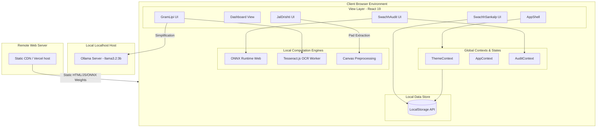
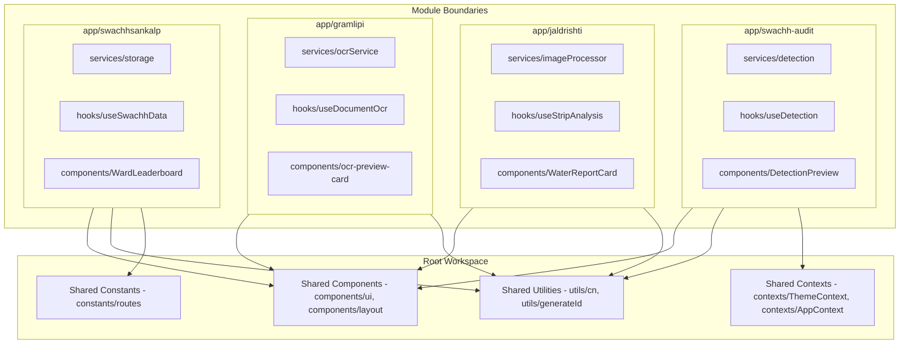
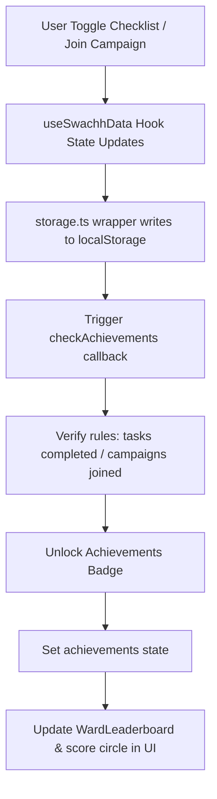
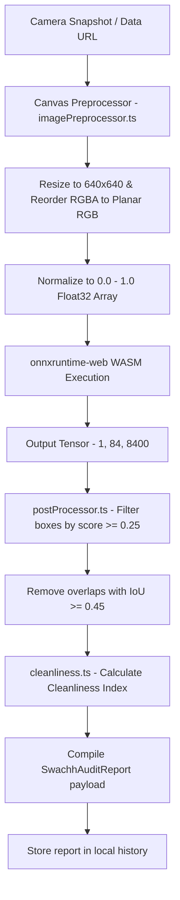
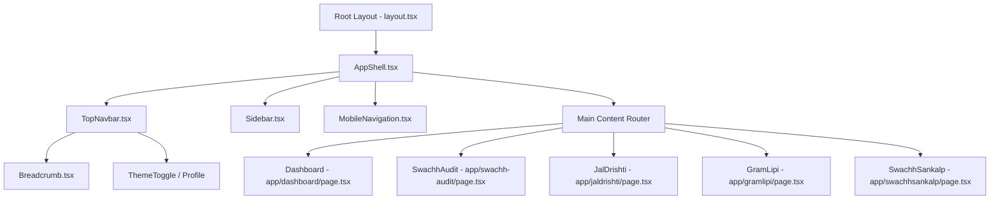
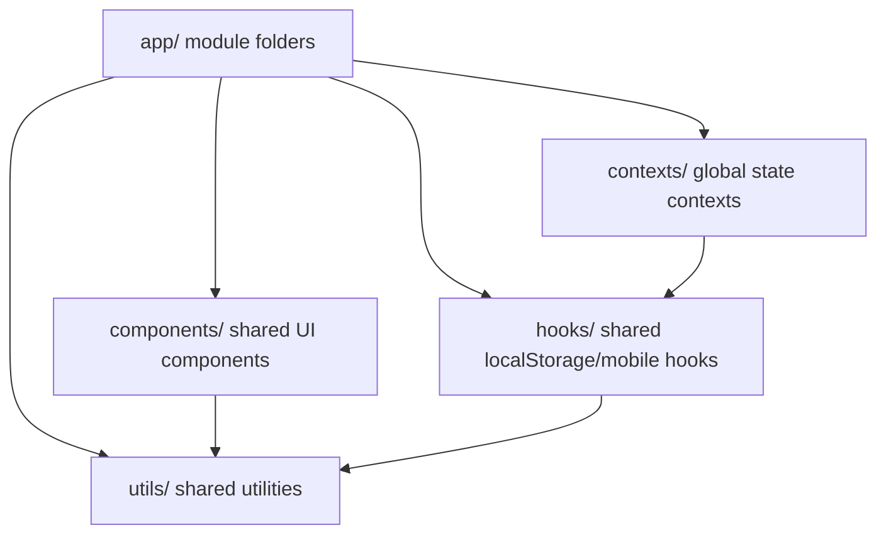

# GramSetu AI - Software Architecture Specification

This document details the architectural layout, modules separation, global contexts, hooks pipelines, and data flow of GramSetu AI.

---

## 1. Overall System Architecture

GramSetu AI utilizes a local-first, zero-cloud architecture. It runs in-browser utilizing client hardware acceleration.

---

## 2. Module Sandboxing & Interactions

Each module inside the `app/` directory (such as `swachh-audit`, `jaldrishti`, `gramlipi`, and `swachhsankalp`) is structured as an isolated sandbox containing its own components, services, and hooks. Shared layouts and core utility functions reside at the root.

---

## 3. Data Flow & Local State Synchronization

Data persistence uses browser `localStorage`. Changes in UI components update the local React state, which is synchronously written to localStorage via hook wrappers.

---

## 4. AI Inference Execution Flow (SwachhAudit)

The pipeline for processing garbage audits starts at camera capture, flows through scale/normalization canvas layers, runs through on-device models, and filters outputs using Non-Maximum Suppression (NMS).

---

## 5. UI Component Hierarchy

The Root Layout renders the shell (`AppShell`) which houses navigation links, routing indicators, and the main page router.

---

## 6. Folder Dependency Flow

Dependencies flow from modular directories to root shared layers. Modules do not import from other modules.

