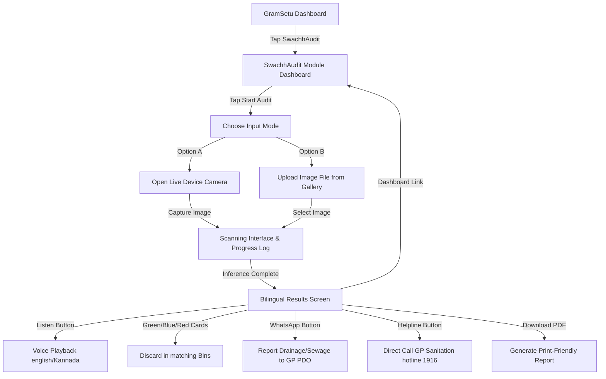

# GramSetu AI — SwachhAudit Module Documentation

SwachhAudit is a lightweight, on-device AI-powered sanitation auditing and waste segregation assistant designed specifically for rural Gram Panchayats and villagers in India. It enables users to take photos of waste or surroundings and receive instant guidance on proper waste classification, dustbin color segregation, and public health reporting.

---

## 1. Core Module Features

### 📡 On-Device YOLOv8 Object Detection
*   **Local WebGL/WASM Inference**: Uses `onnxruntime-web` to load and run a fine-tuned YOLOv8 model directly inside the user's mobile or desktop browser. No image data is sent to external servers, protecting privacy and enabling 100% offline edge processing.
*   **Standard Waste Classifier**: Maps detections across 12 standard classes (Plastic, Cardboard, Glass, Metal, Paper, Batteries, Clothes, Shoes, Biological Waste, and general Trash).

### 🎨 Intelligent Client-Side Pixel Color Analyzer (Mock Fallback)
*   If the large ONNX model weights (14.2 MB) are not yet loaded or cached, the system falls back to a smart heuristic engine.
*   It draws the uploaded image onto a temporary offscreen canvas, extracts average pixel colors, and analyzes color histograms.
*   **Green/Yellow/Orange tones** (ripe fruit, organic leftovers) classify as `Wet Waste`.
*   **Dark/Muddy/Gray tones** (clogged drains, mud pools) classify as `Sanitation Issue`.
*   **Light/Blue/Bright tones** classify as `Dry Waste`.

### 🚨 Traffic-Light Health Banner (Villager-Centric UI)
*   Displays a large, highly animated, blinking status alert at the top of the report:
    *   🟢 **Clean Area (ಸ್ವಚ್ಛ ಪ್ರದೇಶ)**: Score $\ge 75\%$. Sufficiently clean; no action needed.
    *   🟡 **Litter Alert (ಕಸದ ಎಚ್ಚರಿಕೆ)**: Score $40\% - 74\%$. Scattered waste detected; cleaning recommended.
    *   🔴 **Urgent Action (ತುರ್ತು ಕ್ರಮ ಅಗತ್ಯವಿದೆ)**: Score $< 40\%$. Heavy sewage, stagnant water, or toxic battery piles detected.

### 🗣️ Audio Voice Assist ( Tap to Speak / ವರದಿ ಕೇಳಿ )
*   Uses the Web Speech Synthesis API to read the cleanliness rating and segregation instructions aloud.
*   Designed to support low-literacy users, it speaks the instructions in simple English or clear native Kannada (`kn-IN`) depending on the toggle.

### 🔀 Bilingual Toggle (English / ಕನ್ನಡ)
*   A single-tap toggle at the top of the results card instantly translates all terminology, descriptions, recommendations, and button labels between English and Kannada.

### 🗑️ Visual Segregation Dustbins
*   Renders large, high-contrast, color-matching dustbin guides based on detected items:
    *   **GREEN (ಹಸಿರು ಬುಟ್ಟಿ)**: For biodegradable wet/biological waste.
    *   **BLUE (ನೀಲಿ ಬುಟ್ಟಿ)**: For dry recyclable waste (plastics, papers, cans).
    *   **RED (ಕೆಂಪು ಬುಟ್ಟಿ)**: For hazardous electronic/battery waste.

### 💬 One-Click WhatsApp GP PDO Reporting
*   If stagnant water or drainage blockages are detected, the app displays a prominent alert box with a button that instantly generates a pre-formatted message:
    *"Hello Gram Panchayat PDO, reporting sanitation issue (Report ID: ...). Cleanliness Score: .../100. Issues detected: stagnant water/sewage. Please initiate clearing."*
*   Villagers can send this report directly to the Panchayat Development Officer with a single click.

### 🏆 Swachhata Champion Certificate
*   If the audited area achieves a high cleanliness score ($\ge 75\%$), the system generates a **Cleanliness Champion Certificate Badge** allowing villagers to log and share their community achievement.

### 🚨 Panchayat Cleaning Staff Dispatch Request
*   If the cleanliness rating is poor ($< 60\%$), a direct dispatch request button becomes active. Villagers can request the Gram Panchayat to dispatch a sanitation cleaning crew to clear the garbage dump within 24 hours.

### 📞 One-Tap GP Helpline Direct Dial
*   Integrates a direct link to call the Swachh Bharat national sanitation hotline (`1916`) directly from the audit results page.

### 📄 Print-Optimized PDF Report Download
*   Generates a highly simplified, print-optimized document utilizing the browser's native print engine. Includes the report ID, timestamp, cleanliness score, recommendations, and color-bin mapping for physical sharing.

---

## 2. Complete User Flow

### Flow Walkthrough:
1.  **Dashboard Access**: User opens the GramSetu AI suite and launches the SwachhAudit module.
2.  **Capture Phase**: User snaps a picture of waste or uploads a photo from their photo library.
3.  **Live Analysis**: The app processes the image frame. Bounding boxes are drawn overlaying the image, showing target categories in real-time.
4.  **Actionable Results**: The redesigned screen presents the simplified rating, plays voice feedback, shows visual green/blue/red bins, and offers direct links to report issues to the PDO.
5.  **History Log**: The report is saved to local storage and becomes searchable by notes or ID in the History Dashboard.

---

## 3. Technical Architecture

*   **Frontend**: React (Next.js App Router) with Tailwind CSS styling.
*   **Inference Engine**: ONNX Runtime Web (`onnxruntime-web`) leveraging WebGL context/WASM backend.
*   **Speech Synthesis**: Web Speech API (`window.speechSynthesis`).
*   **Bilingual System**: Client-side locale switching utilizing dynamic JSON translation structures.
*   **Report Generation**: Dynamic print-window template rendering.
